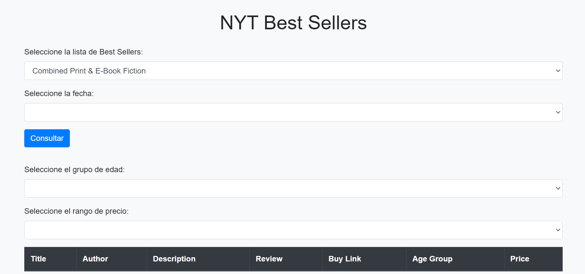

# Proyecto de Consulta y Filtrado de Listas NYT

Este proyecto es una herramienta para consultar y filtrar listas de datos. Antes de utilizarla, asegúrate de seguir estos pasos:

1. **Elegir Nombre y Fecha**: Antes de comenzar, selecciona el nombre de la lista y la fecha que deseas consultar.

2. **Consulta**: Una vez que has elegido la lista y la fecha, puedes proceder a realizar consultas sobre los datos disponibles.

3. **Filtrado por Grupo de Edad y Precio**: Después de realizar la consulta, puedes refinar los resultados filtrando por grupo de edad y precio según tus necesidades.

